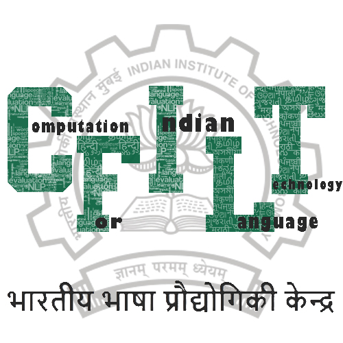

<p align="center"></p>

## IWN Wordlists

We provide the unique word list form the [IndoWordnet (IWN)](https://www.cfilt.iitb.ac.in/indowordnet/) knowledge base. The word list for each language in IWN is available in a separate file where each file contains one word per line.

## Import from HuggingFace

You can also import this dataset using HuggingFace's [Datasets](https://huggingface.co/datasets) library. We have [uploaded it here](https://huggingface.co/datasets/cfilt/iwn_wordlists).

## Citation
```latex
@inproceedings{bhattacharyya2010indowordnet,
  title={IndoWordNet},
  author={Bhattacharyya, Pushpak},
  booktitle={Proceedings of the Seventh International Conference on Language Resources and Evaluation (LREC'10)},
  year={2010}
}
```